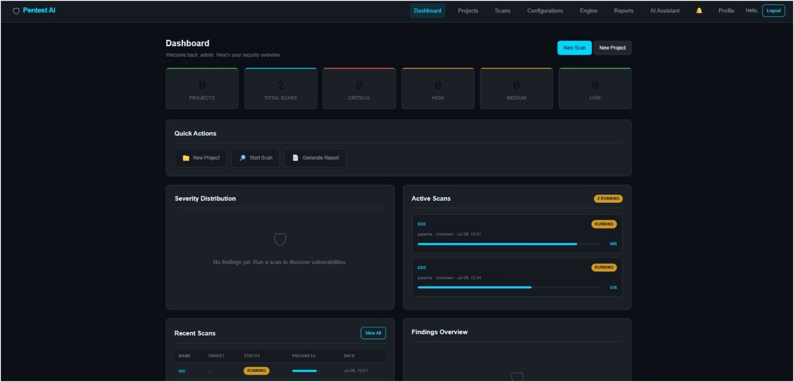
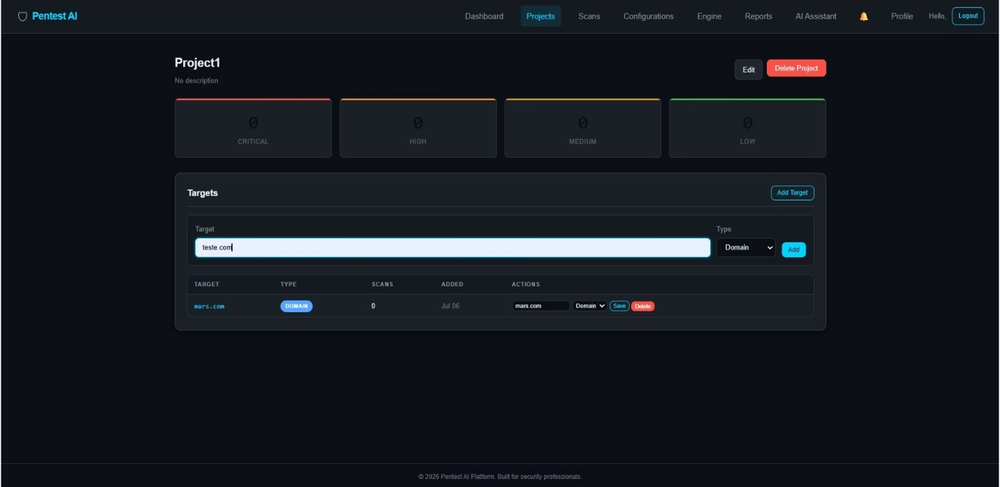
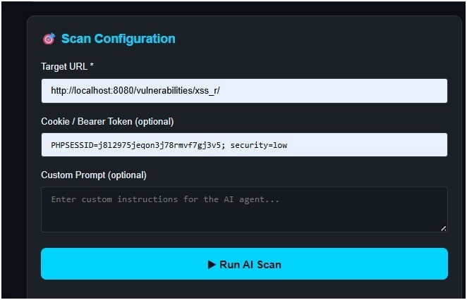
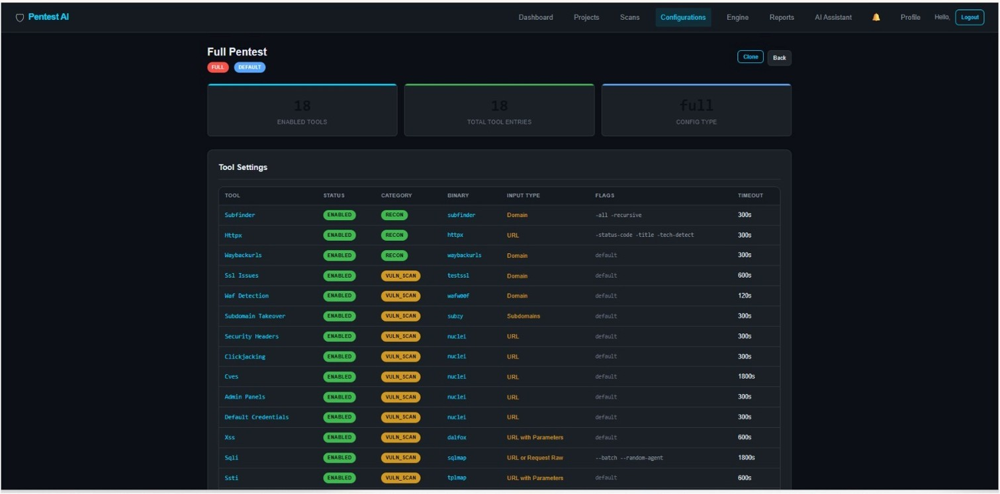
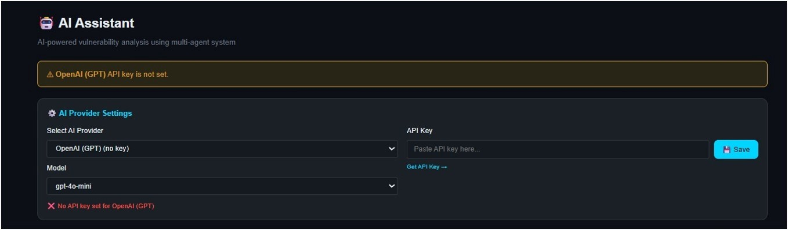
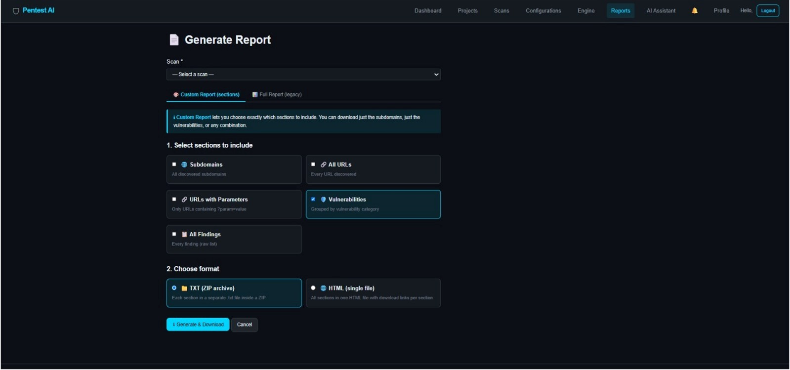
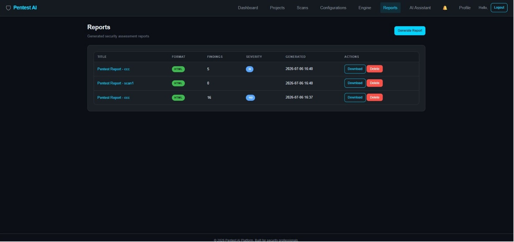

# Fortixa
### Automated AI-Powered Penetration Testing Platform
A comprehensive web-based penetration testing orchestration platform built with Flask. Automates reconnaissance, vulnerability scanning, AI-powered analysis, and professional report generation.
## Tech Stack

- **Backend:** Python, Flask
- **Database:** SQLAlchemy, SQLite
- **Security Testing:** Nmap, Nuclei, SQLMap, Dalfox, Subfinder, Amass, and other security tools
- **AI & Analysis:** AI-assisted vulnerability analysis and security recommendations
- **Frontend:** HTML, CSS, JavaScript
- **Testing:** Pytest

## Project Highlights
- Automated reconnaissance and vulnerability assessment
- Multi-tool security testing through a unified platform
- AI-assisted vulnerability analysis and recommendations
- Automated security report generation
- Role-based access control and target approval workflow
- Built-in security hardening and validation mechanisms

## Screenshots

### Dashboard


### Project Management


### Security Scan


### Vulnerability Findings


### AI Assistant


### Report Generation


### Reports Management


## Features
- **Project Management** — Organize pentest engagements with projects, targets, and findings
- **Target Management** — Add domains, IPs, URLs, and CIDR ranges with admin approval workflow
- **Scan Orchestration** — Configure and run multi-tool scans with a task queue and background worker
- **20 Security Tool Plugins** — Reconnaissance and vulnerability scanners with unified interface
- **AI Analysis** — Rule-based deduplication, severity suggestion, false positive detection, and recommendations
- **Report Generation** — HTML, JSON, and PDF reports with executive summaries and remediation
- **Real-time Dashboard** — Severity charts, active scan monitoring, and notification system
- **Security Hardening** — Rate limiting, security headers, input validation, CSRF protection, and account lockout
- **Role-based Access Control** — User and admin roles with data isolation between users

## Supported Tools

### Reconnaissance (7 tools)
| Tool | Description |
|------|-------------|
| Subfinder | Subdomain discovery |
| Httpx | HTTP probing and tech detection |
| Assetfinder | Passive subdomain discovery |
| Amass | Attack surface mapping |
| Waybackurls | URL discovery from Wayback Machine |
| Gau | URL discovery from multiple sources |
| Katana | Web crawler with JS crawling |

### Vulnerability Scanners (13 tools)
| Tool | Description |
|------|-------------|
| Nuclei | Template-based vulnerability scanner |
| Dalfox | XSS scanning and parameter analysis |
| SQLMap | SQL injection detection and exploitation |
| XSStrike | XSS detection suite |
| Ghauri | SQL injection with WAF bypass |
| Nosqli | NoSQL injection detection |
| SSRFMap | SSRF detection and exploitation |
| Tplmap | Server-side template injection |
| Commix | Command injection detection |
| TestSSL | SSL/TLS security analysis |
| Wafw00f | WAF detection and fingerprinting |
| Subzy | Subdomain takeover detection |
| Dnsx | DNS analysis and enumeration |

## Installation

### Prerequisites
- Python 3.10+
- pip

### Setup

```bash
# Clone the repository
git clone <repository-url>
cd pentest_platform

# Create a virtual environment
python -m venv venv
source venv/bin/activate  # Linux/macOS
# venv\Scripts\activate   # Windows

# Install dependencies
pip install -r requirements.txt

# Set environment variables (optional)
cp .env.example .env
# Edit .env with your settings
```

## Configuration

Environment variables (see `.env.example`):

| Variable | Default | Description |
|----------|---------|-------------|
| `SECRET_KEY` | `dev-secret-key-change-in-production` | Flask secret key (must change in production) |
| `FLASK_ENV` | `development` | `development`, `testing`, or `production` |
| `DATABASE_URL` | `sqlite:///pentest.db` | SQLAlchemy database URI |
| `OUTPUT_DIR` | `output` | Directory for scan outputs and reports |

### Production Checklist
- Set `SECRET_KEY` to a strong random value
- Set `FLASK_ENV=production`
- Use PostgreSQL or MySQL instead of SQLite
- Set `SESSION_COOKIE_SECURE=True` (requires HTTPS)
- Configure a proper WSGI server (Gunicorn, uWSGI)
- Install security tools on the server

## Running the Application

```bash
# Development mode
python run.py

# The application starts at http://localhost:5000
```

### First Steps
1. Register a new account
2. Create a project
3. Add a target (requires admin approval)
4. Approve the target (as admin)
5. Configure and start a scan
6. Review findings and generate reports

## Running Tests

```bash
# Run the full test suite
pytest

# Run with verbose output
pytest -v

# Run a specific test module
pytest tests/test_integration/test_full_workflow.py

# Run with coverage
pytest --cov=app --cov-report=term-missing
```

## Project Structure

```
pentest_platform/
├── app/
│   ├── __init__.py          # Application factory
│   ├── config.py            # Configuration classes
│   ├── extensions.py        # Flask extensions (db, login, csrf)
│   ├── engine/              # Task queue and background worker
│   │   ├── task_queue.py    # SQLite-based FIFO job queue
│   │   └── worker.py        # Background job execution thread
│   ├── middleware/           # Request/response middleware
│   │   └── security.py      # Security headers middleware
│   ├── models/              # SQLAlchemy models
│   │   ├── base.py          # Abstract base model
│   │   ├── user.py          # User accounts and auth
│   │   ├── project.py       # Pentest projects
│   │   ├── target.py        # Scan targets
│   │   ├── scan.py          # Scan records
│   │   ├── scan_job.py      # Individual tool executions
│   │   ├── finding.py       # Vulnerability findings
│   │   ├── configuration.py # Scan configurations
│   │   ├── report.py        # Generated reports
│   │   ├── ai_analysis_result.py  # AI analysis records
│   │   ├── notification.py  # User notifications
│   │   └── ...              # Session, password reset, etc.
│   ├── plugins/             # Security tool plugins
│   │   ├── base.py          # BaseToolRunner abstract class
│   │   ├── registry.py      # Tool registry
│   │   ├── recon/           # 7 reconnaissance tool runners
│   │   └── vuln/            # 13 vulnerability scanner runners
│   ├── routes/              # Flask blueprints
│   │   ├── auth.py          # Authentication routes
│   │   ├── dashboard.py     # Dashboard and stats
│   │   ├── projects.py      # Project CRUD
│   │   ├── scans.py         # Scan management
│   │   ├── configurations.py # Scan configurations
│   │   ├── reports.py       # Report generation
│   │   ├── ai.py            # AI analysis routes
│   │   ├── api.py           # JSON API endpoints
│   │   └── engine.py        # Worker management
│   ├── services/            # Business logic layer
│   │   ├── auth_service.py  # Authentication logic
│   │   ├── project_service.py # Project management
│   │   ├── scan_service.py  # Scan orchestration
│   │   ├── ai_service.py    # AI analysis engine
│   │   ├── report_service.py # Report generation
│   │   ├── configuration_service.py
│   │   ├── finding_service.py
│   │   └── recon_processor.py
│   ├── static/              # CSS, JS, images
│   ├── templates/           # Jinja2 templates
│   └── utils/               # Utilities
│       ├── decorators.py    # Auth, admin, rate limit decorators
│       ├── validators.py    # Input validation functions
│       ├── rate_limiter.py  # Sliding window rate limiter
│       ├── error_handlers.py # Custom exception hierarchy
│       ├── logger.py        # Logging setup
│       └── helpers.py       # General helpers
├── tests/
│   ├── conftest.py          # Pytest fixtures
│   ├── helpers.py           # Integration test helpers
│   ├── test_models/         # Model unit tests
│   ├── test_services/       # Service unit tests
│   ├── test_routes/         # Route integration tests
│   ├── test_plugins/        # Tool plugin tests
│   ├── test_engine/         # Worker and queue tests
│   ├── test_utils/          # Utility tests
│   └── test_integration/    # End-to-end workflow tests
├── output/                  # Scan outputs and reports
├── run.py                   # Application entry point
├── requirements.txt         # Python dependencies
├── .env.example             # Environment variable template
└── .gitignore
```

## Security Considerations

- **Password Security** — Bcrypt/scrypt hashing via Werkzeug; account lockout after 5 failed attempts
- **CSRF Protection** — All forms protected with Flask-WTF CSRF tokens; 1-hour token expiry
- **Session Security** — HttpOnly cookies, SameSite=Lax, Secure flag in production
- **Rate Limiting** — Configurable per-endpoint rate limiting with sliding window algorithm
- **Security Headers** — X-Content-Type-Options, X-Frame-Options, CSP, Referrer-Policy, Permissions-Policy, HSTS
- **Input Validation** — Comprehensive validators for usernames, emails, passwords, scan names, tool flags, and JSON settings
- **Command Injection Prevention** — All tool runners validate targets and use subprocess-style command lists (never `shell=True`)
- **Target Approval** — Targets require admin approval before scanning to prevent unauthorized scanning
- **Data Isolation** — Users can only access their own projects, scans, and reports
- **Error Handling** — Custom exception hierarchy with JSON responses for API routes and HTML for browser routes

## License

MIT
